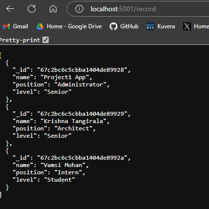
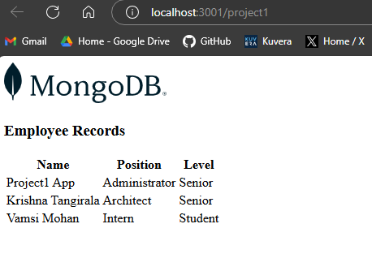

# Project 2

## Instructions to run this project

- Server
  - Change to the directory ./server
  - From the command prompt, execute the command "npm run start"
  - Pre-requisite is for MongoDB to be installed in your local and accessible at port 27017

- Client
  - Change to the directory ./client
  - From the command prompt, execute the command "npm run start"
  - Pre-requisite is for Server to be running on port 5002
- Access the environment at http://localhost:3002/project2

